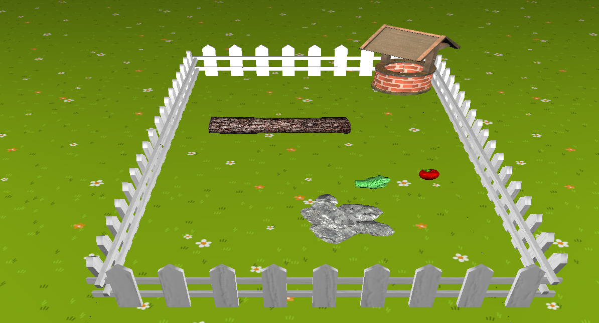

# 3D Snake Game
## Description:
3D representation using OpenGL of the popular Snake game. During the implementation, 8 textured models were used, two light sources and shading were introduced. 
For better entertainment, we have added obstacles that the snake must avoid and a double-scored golden apple that makes the game more difficult, in the form of snake acceleration. 
The project was co-created with Jakub Garus. 
Game presentation:  
   

